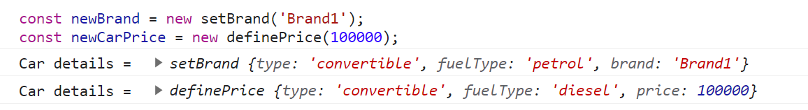

# Call，Apply，Bind

call和apply改变函数内部的this指向，

```javascript
func.call(thisObj, args1, args2, ...)
1, func is a function that needs to be invoked with a different this object
2, thisObj is an object or a value that needs to be replaced with the this keyword present inside the function func
3, args1, args2 are arguments that are passed to the invoking function with the changed this object.
```


```javascript
function Car(type, fuelType){
	this.type = type;
	this.fuelType = fuelType;
}

function setBrand(brand){
	Car.call(this, "convertible", "petrol");
	this.brand = brand;
	console.log(`Car details = `, this);
}

function definePrice(price){
	Car.call(this, "convertible", "diesel");
	this.price = price;
	console.log(`Car details = `, this);
}

const newBrand = new setBrand('Brand1');
const newCarPrice = new definePrice(100000);
```

